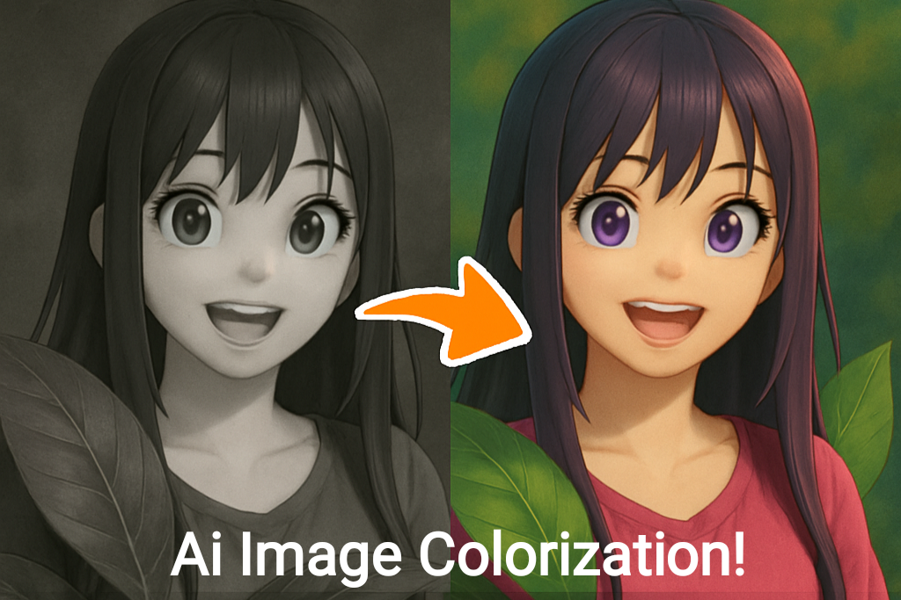
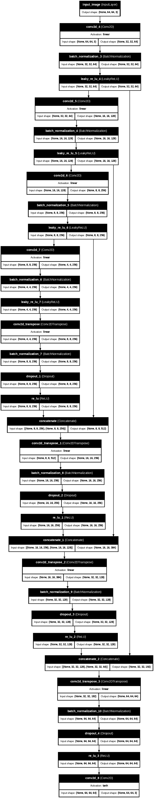
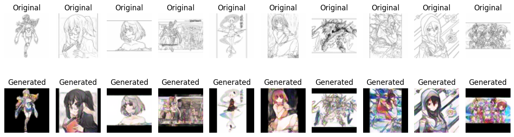

# Simple Image Colorisation with TensorFlow

*Understanding GAN (Generative Adversarial Networks) with simple image colorization project with code*




## Table of Contents

1. [Introduction](#introduction)
2. [Problem Statement](#problem-statement)
3. [Requirements](#requirements)
4. [Code](#code)
    - 4.1. [Imports](#imports)
    - 4.2. [Dataset](#dataset)
    - 4.3. [Process the images](#process-the-images)
    - 4.4. [Function to display the images](#function-to-display-the-images)
    - 4.5. [Discriminator](#discriminator)
    - 4.6. [Generator](#generator)
    - 4.7. [Function to generate samples](#function-to-generate-samples)
    - 4.8. [Creating the GAN for Training](#creating-the-gan-for-training)
5. [Inference Model Prediction](#inference-model-prediction)
6. [Conclusion](#conclusion)
7. [Additional Resources](#additional-resources)

## Introduction


What is image colorization? 

Image colorization using deep learning involves converting grayscale images into full-color images by predicting the missing color information.

The deep learning model is designed to predict colors that are realistic and spatially coherent, ensuring that the colorized images look natural and consistent.

Example of how the model will work.

The model takes a grayscale image (3 channels) as input and outputs a full-color RGB image (3 channels):

## Problem Statement

This project aims to develop a deep learning GAN (Generative Adversarial Network) model to convert black-and-white images into colored images.  

To understand how GANs work, you can check out the [GAN Tutorial by TensorFlow](https://www.tensorflow.org/tutorials/generative/dcgan).  


## Requirements

1. **NumPy** - [NumPy Documentation](https://numpy.org/doc/)  
2. **TensorFlow** - [TensorFlow Documentation](https://www.tensorflow.org/)  
3. **Convolutional Neural Networks (CNNs)** - Key components:
    - [Conv2D](https://www.tensorflow.org/api_docs/python/tf/keras/layers/Conv2D)
    - [LeakyReLU](https://www.tensorflow.org/api_docs/python/tf/keras/layers/LeakyReLU)
    - [BatchNormalization](https://www.tensorflow.org/api_docs/python/tf/keras/layers/BatchNormalization)
    - [Flatten](https://www.tensorflow.org/api_docs/python/tf/keras/layers/Flatten)
    - [Dropout](https://www.tensorflow.org/api_docs/python/tf/keras/layers/Dropout)
    - [Dense](https://www.tensorflow.org/api_docs/python/tf/keras/layers/Dense)
4. **Google colab** or other devices.
5. **Training Duration** – Training can be time-intensive. In my case, the model required around 5 hours to train.

## Code

1. ###  <u>Imports:</u>

```python
#!pip install datasets
from datasets import load_dataset
import cv2
import numpy as np
import matplotlib.pyplot as plt
from PIL import Image
import tensorflow as tf
from tensorflow.keras.utils import plot_model
```

2. ### <u>Dataset:</u>

<sub><i>I used public available dataset from hugging face but you can use yours !</i></sub>

```python
ds = load_dataset("calibretaliation/colorization", split=f"train[:5000]")
# 5000 rows used total 299k rows available
```

3. ### <u>Process the images:</u>

```python
def resize_and_preprocess(image, target_size=(32, 32)):
    image = np.array(image)
    if image.ndim == 2:
        image = np.stack([image] * 3, axis=-1)

    image = tf.convert_to_tensor(image, dtype=tf.float32)
    image = tf.image.resize(image, target_size)
    image = (image / 127.5) - 1

    return image

def process_dataset(example):
    return {
        'colorized_image': resize_and_preprocess(example['colorized_image'], (64, 64)),
        'original_image': resize_and_preprocess(example['original_image'], (64, 64))
        }

ds = ds.map(process_dataset, num_proc=4)
```
next separate the colored and black-and-white images:
```python
train_colored = np.array([item for item in ds['colorized_image']])
train_bw = np.array([item for item in ds['original_image']])
```

4. ### <u>Function to display the images:</u>

```python
def view_image(generated_images, original_images, num_images=3):
    plt.figure(figsize=(12, 4))

    # Display original grayscale images
    for i in range(num_images):
        plt.subplot(2, num_images, i + 1)
        gray_img = np.squeeze(original_images[i])
        plt.imshow(((gray_img + 1) * 127.5).astype(np.uint8), cmap='gray')
        plt.axis('off')
        plt.title('Original')

    # Display generated color images
    for i in range(num_images):
        plt.subplot(2, num_images, num_images + i + 1)
        color_img = generated_images[i]
        plt.imshow(((color_img + 1) * 127.5).astype(np.uint8))
        plt.axis('off')
        plt.title('Generated')

    plt.tight_layout()
    plt.show()
```
sample usage:
```python
view_image(train_colored[5:9], train_bw[5:9], num_images=4)
```
Output looks like the image below:
Note that Original meaning black and white and target is RGB colored and generated should be the image generated by the model. In the below image Generated image displaying is the target image for the GAN.


---
5. ### <u>**Discriminator**</u>
---
```python
def discriminator(shape=(32, 32, 3)):
    image = tf.keras.layers.Input(shape=shape, name='input_image')

    x = tf.keras.layers.Conv2D(64, (3, 3), strides=(1, 1), padding='same')(image)
    x = tf.keras.layers.LeakyReLU(alpha=0.2)(x)

    x = tf.keras.layers.Conv2D(128, (3, 3), strides=(2, 2), padding='same')(x)
    x = tf.keras.layers.BatchNormalization()(x)
    x = tf.keras.layers.LeakyReLU(alpha=0.2)(x)

    x = tf.keras.layers.Conv2D(128, (3, 3), strides=(2, 2), padding='same')(x)
    x = tf.keras.layers.BatchNormalization()(x)
    x = tf.keras.layers.LeakyReLU(alpha=0.2)(x)

    x = tf.keras.layers.Conv2D(256, (3, 3), strides=(2, 2), padding='same')(x)
    x = tf.keras.layers.BatchNormalization()(x)
    x = tf.keras.layers.LeakyReLU(alpha=0.2)(x)

    x = tf.keras.layers.Flatten()(x)
    x = tf.keras.layers.Dropout(0.4)(x)

    x = tf.keras.layers.Dense(1, activation='sigmoid')(x)

    model = tf.keras.Model(inputs=image, outputs=x, name='Discriminator')
    model.compile(
        loss='binary_crossentropy',
        optimizer=tf.keras.optimizers.Adam(learning_rate=0.0002, beta_1=0.5),
        metrics=['accuracy']
    )

    return model
```
- Model Summary:
```python
d_model = discriminator(shape=(64, 64, 3))
d_model.summary()
```

Model: "Discriminator"
| Layer (type)                         | Output Shape                |         Param # |
| ------------------------------------ | --------------------------- | ---------------:|
| input_image (InputLayer)             | (None, 64, 64, 3)           |               0 |
| conv2d_4 (Conv2D)                    | (None, 64, 64, 64)          |           1,792 |
| leaky_re_lu_4 (LeakyReLU)            | (None, 64, 64, 64)          |               0 |
| conv2d_5 (Conv2D)                    | (None, 32, 32, 128)         |          73,856 |
| batch_normalization_3                | (None, 32, 32, 128)         |             512 |
| (BatchNormalization)                 |                             |                 |
| leaky_re_lu_5 (LeakyReLU)            | (None, 32, 32, 128)         |               0 |
| conv2d_6 (Conv2D)                    | (None, 16, 16, 128)         |         147,584 |
| batch_normalization_4                | (None, 16, 16, 128)         |             512 |
| (BatchNormalization)                 |                             |                 |
| leaky_re_lu_6 (LeakyReLU)            | (None, 16, 16, 128)         |               0 |
| conv2d_7 (Conv2D)                    | (None, 8, 8, 256)           |         295,168 |
| batch_normalization_5                | (None, 8, 8, 256)           |           1,024 |
| (BatchNormalization)                 |                             |                 |
| leaky_re_lu_7 (LeakyReLU)            | (None, 8, 8, 256)           |               0 |
| flatten_1 (Flatten)                  | (None, 16384)               |               0 |
| dropout_1 (Dropout)                  | (None, 16384)               |               0 |
| dense_1 (Dense)                      | (None, 1)                   |          16,385 |

- **Total params**: 536,833 (2.05 MB)
- **Trainable params**: 535,809 (2.04 MB)
- **Non-trainable params**: 1,024 (4.00 KB)

```python
plot_model(d_model, show_shapes=True, show_layer_names=True)
```

It should look like the below architecture!

<details>
  <summary>Show/Hide image (png) of discriminator architecture</summary>
  
</details>


---
6. ### <u>**Generator**:</u>
---
```python
def generator(input_shape=(32, 32, 1)):
    input_image = tf.keras.layers.Input(shape=input_shape, name='input_image')

    x = tf.keras.layers.Conv2D(64, (3, 3), padding='same')(input_image)
    x = tf.keras.layers.LeakyReLU(alpha=0.2)(x)
    x = tf.keras.layers.Conv2D(128, (3, 3), strides=(2, 2), padding='same')(x)
    x = tf.keras.layers.BatchNormalization()(x)
    x = tf.keras.layers.LeakyReLU(alpha=0.2)(x)

    x = tf.keras.layers.Conv2D(256, (3, 3), strides=(2, 2), padding='same')(x)
    x = tf.keras.layers.BatchNormalization()(x)
    x = tf.keras.layers.LeakyReLU(alpha=0.2)(x)

    x = tf.keras.layers.Conv2D(512, (3, 3), strides=(2, 2), padding='same')(x)
    x = tf.keras.layers.BatchNormalization()(x)
    x = tf.keras.layers.LeakyReLU(alpha=0.2)(x)

    x = tf.keras.layers.Conv2DTranspose(256, (3, 3), strides=(2, 2), padding='same')(x)
    x = tf.keras.layers.BatchNormalization()(x)
    x = tf.keras.layers.ReLU()(x)

    x = tf.keras.layers.Conv2DTranspose(128, (3, 3), strides=(2, 2), padding='same')(x)
    x = tf.keras.layers.BatchNormalization()(x)
    x = tf.keras.layers.ReLU()(x)

    x = tf.keras.layers.Conv2DTranspose(64, (3, 3), strides=(2, 2), padding='same')(x)
    x = tf.keras.layers.ReLU()(x)

    output = tf.keras.layers.Conv2D(3, (3, 3), activation='tanh', padding='same')(x)

    model = tf.keras.Model(inputs=input_image, outputs=output, name='Generator')
    return model
```
You can try the above architecture(It will give good results) but I tried a bit different, I added skip connections inspired by the [U-Net](https://paperswithcode.com/method/u-net) architecture.

<i>Below is the Generator I used:<i>

```python
def generator(input_shape=(64, 64, 3)):
    input_image = tf.keras.layers.Input(shape=input_shape, name='input_image')

    down1 = tf.keras.layers.Conv2D(64, (3, 3), strides=(2, 2), padding='same')(input_image)
    bn1 = tf.keras.layers.BatchNormalization()(down1)
    act1 = tf.keras.layers.LeakyReLU(alpha=0.2)(bn1)

    down2 = tf.keras.layers.Conv2D(128, (3, 3), strides=(2, 2), padding='same')(act1)
    bn2 = tf.keras.layers.BatchNormalization()(down2)
    act2 = tf.keras.layers.LeakyReLU(alpha=0.2)(bn2)

    down3 = tf.keras.layers.Conv2D(256, (3, 3), strides=(2, 2), padding='same')(act2)
    bn3 = tf.keras.layers.BatchNormalization()(down3)
    act3 = tf.keras.layers.LeakyReLU(alpha=0.2)(bn3)

    down4 = tf.keras.layers.Conv2D(256, (3, 3), strides=(2, 2), padding='same')(act3)
    bn4 = tf.keras.layers.BatchNormalization()(down4)
    act4 = tf.keras.layers.LeakyReLU(alpha=0.2)(bn4)

    up = tf.keras.layers.Conv2DTranspose(256, (3, 3), strides=(2, 2), padding='same')(act4)
    bn_up = tf.keras.layers.BatchNormalization()(up)
    drop = tf.keras.layers.Dropout(0.2)(bn_up)
    relu_up = tf.keras.layers.ReLU()(drop)
    skip = tf.keras.layers.Concatenate()([relu_up, act3])

    up1 = tf.keras.layers.Conv2DTranspose(256, (3, 3), strides=(2, 2), padding='same')(skip)
    bn_up1 = tf.keras.layers.BatchNormalization()(up1)
    drop1 = tf.keras.layers.Dropout(0.2)(bn_up1)
    relu_up1 = tf.keras.layers.ReLU()(drop1)
    skip1 = tf.keras.layers.Concatenate()([relu_up1, act2])

    up2 = tf.keras.layers.Conv2DTranspose(128, (3, 3), strides=(2, 2), padding='same')(skip1)
    bn_up2 = tf.keras.layers.BatchNormalization()(up2)
    drop2 = tf.keras.layers.Dropout(0.2)(bn_up2)
    relu_up2 = tf.keras.layers.ReLU()(drop2)
    skip2 = tf.keras.layers.Concatenate()([relu_up2, act1])

    up3 = tf.keras.layers.Conv2DTranspose(64, (3, 3), strides=(2, 2), padding='same')(skip2)
    bn_up3 = tf.keras.layers.BatchNormalization()(up3)
    drop3 = tf.keras.layers.Dropout(0.2)(bn_up3)
    relu_up3 = tf.keras.layers.ReLU()(drop3)

    output = tf.keras.layers.Conv2D(3, (3, 3), activation='tanh', padding='same')(relu_up3)

    model = tf.keras.Model(inputs=input_image, outputs=output, name='Generator')
    return model
```
Now check it's summary carefully!
```python
g_model = generator(input_shape=(64, 64, 1))
g_model.summary()
```

Model: "Generator"

| Layer (type)              | Output Shape           |        Param # | Connected to           |
| ------------------------- | ---------------------- | -------------- | ---------------------- |
| input_image (InputLayer)  | (None, 64, 64, 3)      |              0 | -                      |
| conv2d_4 (Conv2D)         | (None, 32, 32, 64)     |          1,792 | input_image[0][0]      |
| batch_normalization_3     | (None, 32, 32, 64)     |            256 | conv2d_4[0][0]         |
| (BatchNormalization)      |                        |                |                        |
| leaky_re_lu_4 (LeakyReLU) | (None, 32, 32, 64)     |              0 | batch_normalization_3… |
| conv2d_5 (Conv2D)         | (None, 16, 16, 128)    |         73,856 | leaky_re_lu_4[0][0]    |
| batch_normalization_4     | (None, 16, 16, 128)    |            512 | conv2d_5[0][0]         |
| (BatchNormalization)      |                        |                |                        |
| leaky_re_lu_5 (LeakyReLU) | (None, 16, 16, 128)    |              0 | batch_normalization_4… |
| conv2d_6 (Conv2D)         | (None, 8, 8, 256)      |        295,168 | leaky_re_lu_5[0][0]    |
| batch_normalization_5     | (None, 8, 8, 256)      |          1,024 | conv2d_6[0][0]         |
| (BatchNormalization)      |                        |                |                        |
| leaky_re_lu_6 (LeakyReLU) | (None, 8, 8, 256)      |              0 | batch_normalization_5… |
| conv2d_7 (Conv2D)         | (None, 4, 4, 256)      |        590,080 | leaky_re_lu_6[0][0]    |
| batch_normalization_6     | (None, 4, 4, 256)      |          1,024 | conv2d_7[0][0]         |
| (BatchNormalization)      |                        |                |                        |
| leaky_re_lu_7 (LeakyReLU) | (None, 4, 4, 256)      |              0 | batch_normalization_6… |
| conv2d_transpose          | (None, 8, 8, 256)      |        590,080 | leaky_re_lu_7[0][0]    |
| (Conv2DTranspose)         |                        |                |                        |
| batch_normalization_7     | (None, 8, 8, 256)      |          1,024 | conv2d_transpose[0][0] |
| (BatchNormalization)      |                        |                |                        |
| dropout_1 (Dropout)       | (None, 8, 8, 256)      |              0 | batch_normalization_7… |
| re_lu (ReLU)              | (None, 8, 8, 256)      |              0 | dropout_1[0][0]        |
| concatenate (Concatenate) | (None, 8, 8, 512)      |              0 | re_lu[0][0],           |
|                           |                        |                | leaky_re_lu_6[0][0]    |
| conv2d_transpose_1        | (None, 16, 16, 256)    |      1,179,904 | concatenate[0][0]      |
| (Conv2DTranspose)         |                        |                |                        |
| batch_normalization_8     | (None, 16, 16, 256)    |          1,024 | conv2d_transpose_1[0]… |
| (BatchNormalization)      |                        |                |                        |
| dropout_2 (Dropout)       | (None, 16, 16, 256)    |              0 | batch_normalization_8… |
| re_lu_1 (ReLU)            | (None, 16, 16, 256)    |              0 | dropout_2[0][0]        |
| concatenate_1             | (None, 16, 16, 384)    |              0 | re_lu_1[0][0],         |
| (Concatenate)             |                        |                | leaky_re_lu_5[0][0]    |
| conv2d_transpose_2        | (None, 32, 32, 128)    |        442,496 | concatenate_1[0][0]    |
| (Conv2DTranspose)         |                        |                |                        |
| batch_normalization_9     | (None, 32, 32, 128)    |            512 | conv2d_transpose_2[0]… |
| (BatchNormalization)      |                        |                |                        |
| dropout_3 (Dropout)       | (None, 32, 32, 128)    |              0 | batch_normalization_9… |
| re_lu_2 (ReLU)            | (None, 32, 32, 128)    |              0 | dropout_3[0][0]        |
| concatenate_2             | (None, 32, 32, 192)    |              0 | re_lu_2[0][0],         |
| (Concatenate)             |                        |                | leaky_re_lu_4[0][0]    |
| conv2d_transpose_3        | (None, 64, 64, 64)     |        110,656 | concatenate_2[0][0]    |
| (Conv2DTranspose)         |                        |                |                        |
| batch_normalization_10    | (None, 64, 64, 64)     |            256 | conv2d_transpose_3[0]… |
| (BatchNormalization)      |                        |                |                        |
| dropout_4 (Dropout)       | (None, 64, 64, 64)     |              0 | batch_normalization_1… |
| re_lu_3 (ReLU)            | (None, 64, 64, 64)     |              0 | dropout_4[0][0]        |
| conv2d_8 (Conv2D)         | (None, 64, 64, 3)      |          1,731 | re_lu_3[0][0]          |

- **Total params**: 3,291,395 (12.56 MB)
- **Trainable params**: 3,288,579 (12.54 MB)
- **Non-trainable params**: 2,816 (11.00 KB)

```python
plot_model(g_model, show_shapes=True, show_layer_names=True)
```

It should look like the below architecture!

<details>
  <summary>Show/Hide image (png) of generator architecture</summary>
  
</details>

---
7. ### <u>Function to generate samples</u>--
---

- for real (colored) and not-real or fake (black-&-white) images with its labels as '1's for real and '0's for not-real.

```python
def generate_samples(dataset, n_samples, is_real):
    ix = np.random.randint(0, dataset.shape[0], n_samples)
    X = dataset[ix]
    y = np.ones((n_samples, 1)) if is_real else np.zeros((n_samples, 1))
    return X, y
```

- for generating **generator** images, in this below function fake or not-real is the one which is generated by the generator.

```python
def generate_generator_samples(g_model, dataset, n_samples, is_real=False):
    ix = np.random.randint(0, dataset.shape[0], n_samples)
    X = dataset[ix]
    gen_images = g_model.predict(X, verbose=0)
    y = np.ones((n_samples, 1)) if is_real else np.zeros((n_samples, 1))
    return gen_images, y
```


8. ### <u>Creating the GAN for Training</u>


```python
# below code is to calculate and summarize the losses
def summarize_performance(epoch, g_model, d_model, dataset_colored, dataset_bw, n_samples=100):
    X_real, y_real = generate_samples(dataset_colored, n_samples, is_real=True)
    _, acc_real = d_model.evaluate(X_real, y_real, verbose=0)

    X_fake, y_fake = generate_generator_samples(g_model, dataset_bw, n_samples, is_real=False)
    _, acc_fake = d_model.evaluate(X_fake, y_fake, verbose=0)

    print(f"Accuracy real: {acc_real*100:.2f}%, Accuracy fake: {acc_fake*100:.2f}%")
    view_image(X_fake[:5], X_fake[5:10])

# next we create the entire GAN model by linking the discriminator and the generator
def define_gan(g_model, d_model, shape):
    d_model.trainable = False # it is important step, to prevent Discriminator from updating during GAN Training 
    #If the discriminator is trainable while training the GAN, it will get updated alongside the generator, which can disrupt the adversarial learning process.
    # By setting it False, we freeze the discriminator’s weights when training the generator.

    gan_input = tf.keras.layers.Input(shape=shape)
    g_output = g_model(gan_input)
    
    d_output = d_model(g_output)

    model = tf.keras.Model(inputs=gan_input, outputs=[g_output, d_output], name='GAN')

    optimizer = tf.keras.optimizers.Adam(
        learning_rate=0.0002,
        beta_1=0.5,
        clipnorm=1.0
    )

    model.compile(
        loss=['mae', 'binary_crossentropy'],  # L1 loss give good result but we can add custom losses like perceptual loss functions or others
        loss_weights=[100, 1],
        optimizer=optimizer
    )

    return model

def train_gan(g_model, d_model, gan_model, dataset_colored, dataset_bw, epochs=50, batch_size=128):
    batch_per_epoch = dataset_colored.shape[0] // batch_size

    for epoch in range(epochs):
        for batch in range(batch_per_epoch):
            idx = np.random.randint(0, dataset_colored.shape[0], batch_size)
            real_images = dataset_colored[idx]
            bw_images = dataset_bw[idx]

            # Generate fake samples
            generated_images = g_model.predict(bw_images, verbose=0)

            # Train discriminator
            d_loss_real = d_model.train_on_batch(real_images, np.ones((batch_size, 1)))
            d_loss_fake = d_model.train_on_batch(generated_images, np.zeros((batch_size, 1)))

            # Ensure values are scalars
            d_loss_real = d_loss_real[0] if isinstance(d_loss_real, (list, np.ndarray)) else d_loss_real
            d_loss_fake = d_loss_fake[0] if isinstance(d_loss_fake, (list, np.ndarray)) else d_loss_fake
            d_loss = 0.5 * np.add(d_loss_real, d_loss_fake)

            # Train generator
            g_loss = gan_model.train_on_batch(bw_images, [real_images, np.ones((batch_size, 1))])
            g_total, g_custom, g_bce = g_loss[:3] if isinstance(g_loss, (list, np.ndarray)) else (g_loss, 0, 0)

# You can view the images more frequently to check out how from initial almost grey image step by step starts generating colors
        # Print progress every 10 epochs
        if (epoch + 1) % 10 == 0:
            print(f"Epoch: {epoch+1}/{epochs}")
            print(f"D1 Loss: {d_loss_real:.4f}, D2 Loss: {d_loss_fake:.4f}")
            print(f"G Total Loss: {g_total:.4f}, G Custom Loss: {g_custom:.4f}, G BCE Loss: {g_bce:.4f}")

        # Show progress every 5 epochs
        if (epoch + 1) % 50 == 0:
            idx = np.random.randint(0, dataset_bw.shape[0], 3)
            generated_images = g_model.predict(dataset_bw[idx], verbose=0)
            view_image(generated_images, dataset_bw[idx])

import time

shape=(64, 64, 3)
g_model = generator(shape)
d_model = discriminator(shape)
gan_model = define_gan(g_model, d_model, shape)

start_time = time.time() # To check how much time its taking
train_gan(g_model, d_model, gan_model, train_colored, train_bw, epochs=1000, batch_size=128)
end_time = time.time()
```

The above code should run fine but why dont we go further and add custom losses
- next add custom loss (I used [VGG19](https://www.tensorflow.org/api_docs/python/tf/keras/applications/VGG19) for feature extractor)

```python
vgg = tf.keras.applications.VGG19(include_top=False, weights='imagenet', input_shape=(64, 64, 3))
vgg.trainable = False
vgg_feature_extractor = tf.keras.Model(inputs=vgg.input, outputs=vgg.get_layer('block3_conv3').output)

@tf.function(reduce_retracing=True)
def perceptual_loss(y_true, y_pred):
    y_true_processed = tf.keras.applications.vgg19.preprocess_input(y_true * 255.0)
    y_pred_processed = tf.keras.applications.vgg19.preprocess_input(y_pred * 255.0)
    
    features_true = vgg_feature_extractor(y_true_processed)
    features_pred = vgg_feature_extractor(y_pred_processed)
    
    return tf.reduce_mean(tf.abs(features_true - features_pred))

def l1_loss(y_true, y_pred):
    return tf.reduce_mean(tf.abs(y_true - y_pred))
bce = tf.keras.losses.BinaryCrossentropy(from_logits=False)

def gan_loss(disc_generated_output):
    return bce(tf.ones_like(disc_generated_output), disc_generated_output)

def combined_generator_loss(y_true, y_pred, disc_generated_output, lambda_l1=100.0, lambda_perc=10.0):
    l1 = l1_loss(y_true, y_pred)
    perc = perceptual_loss(y_true, y_pred)
    g_loss = gan_loss(disc_generated_output)
    
    total_loss = g_loss + (lambda_l1 * l1) + (lambda_perc * perc)
    return total_loss

def define_gan(g_model, d_model, shape):
    d_model.trainable = False

    gan_input = tf.keras.layers.Input(shape=shape)
    g_output = g_model(gan_input)
    
    d_output = d_model(g_output)

    model = tf.keras.Model(inputs=gan_input, outputs=[g_output, d_output], name='GAN')

    optimizer = tf.keras.optimizers.Adam(
        learning_rate=0.0002,
        beta_1=0.5,
        clipnorm=1.0
    )

    def total_loss(y_true, y_pred):
        return combined_generator_loss(y_true, y_pred, d_model(y_pred))

    model.compile(
        loss=[total_loss, 'binary_crossentropy'],  
        loss_weights=[100, 1],
        optimizer=optimizer
    )

    return model

def summarize_performance(epoch, g_model, d_model, dataset_colored, dataset_bw, n_samples=100):
    X_real, y_real = generate_samples(dataset_colored, n_samples, is_real=True)
    _, acc_real = d_model.evaluate(X_real, y_real, verbose=0)

    X_fake, y_fake = generate_generator_samples(g_model, dataset_bw, n_samples, is_real=False)
    _, acc_fake = d_model.evaluate(X_fake, y_fake, verbose=0)

    print(f"Accuracy real: {acc_real*100:.2f}%, Accuracy fake: {acc_fake*100:.2f}%")
    view_image(X_fake[:5], X_fake[5:10])

def train_gan(g_model, d_model, gan_model, dataset_colored, dataset_bw, epochs=50, batch_size=128):
    batch_per_epoch = dataset_colored.shape[0] // batch_size

    for epoch in range(epochs):
        for batch in range(batch_per_epoch):
            idx = np.random.randint(0, dataset_colored.shape[0], batch_size)
            real_images = dataset_colored[idx]
            bw_images = dataset_bw[idx]

            # Generate fake samples
            generated_images = g_model.predict(bw_images, verbose=0)

            # Train discriminator
            d_loss_real = d_model.train_on_batch(real_images, np.ones((batch_size, 1)))
            d_loss_fake = d_model.train_on_batch(generated_images, np.zeros((batch_size, 1)))

            # Ensure values are scalars
            d_loss_real = d_loss_real[0] if isinstance(d_loss_real, (list, np.ndarray)) else d_loss_real
            d_loss_fake = d_loss_fake[0] if isinstance(d_loss_fake, (list, np.ndarray)) else d_loss_fake
            d_loss = 0.5 * np.add(d_loss_real, d_loss_fake)

            # Train generator
            g_loss = gan_model.train_on_batch(bw_images, [real_images, np.ones((batch_size, 1))])
            g_total, g_custom, g_bce = g_loss[:3] if isinstance(g_loss, (list, np.ndarray)) else (g_loss, 0, 0)

        # Print progress every 10 epochs
        if (epoch + 1) % 10 == 0:
            print(f"Epoch: {epoch+1}/{epochs}")
            print(f"D1 Loss: {d_loss_real:.4f}, D2 Loss: {d_loss_fake:.4f}")
            print(f"G Total Loss: {g_total:.4f}, G Custom Loss: {g_custom:.4f}, G BCE Loss: {g_bce:.4f}")

        # Show progress every 5 epochs
        if (epoch + 1) % 50 == 0:
            idx = np.random.randint(0, dataset_bw.shape[0], 3)
            generated_images = g_model.predict(dataset_bw[idx], verbose=0)
            view_image(generated_images, dataset_bw[idx])
```

The above code will run but it is better to add check point as while using the google colab(free / not pro) it will stop suddenly after around 600 epoch so after updating the code further (adding checkpoint and learning rate schedular).

```python
def define_gan(g_model, d_model, shape):
    d_model.trainable = False

    gan_input = tf.keras.layers.Input(shape=shape)
    g_output = g_model(gan_input)

    d_output = d_model(g_output)

    model = tf.keras.Model(inputs=gan_input, outputs=[g_output, d_output], name='GAN')

    initial_learning_rate = 0.0002
    decay_steps = 10000
    decay_rate = 0.96

    lr_schedule = tf.keras.optimizers.schedules.ExponentialDecay(
        initial_learning_rate,
        decay_steps=decay_steps,
        decay_rate=decay_rate,
        staircase=True
    )

    optimizer = tf.keras.optimizers.Adam(
        learning_rate=lr_schedule,
        beta_1=0.5,
        clipnorm=1.0
    )


    def total_loss(y_true, y_pred):
        return combined_generator_loss(y_true, y_pred, d_model(y_pred))

    model.compile(
        loss=[total_loss, 'binary_crossentropy'],
        loss_weights=[100, 1], # Change the parameters according to the image the model generating
        optimizer=optimizer
    )

    return model

def train_gan(g_model, d_model, gan_model, dataset_colored, dataset_bw, epochs=50, batch_size=128, checkpoint_dir='./training_checkpoints'):
    # Create checkpoint directory if it doesn't exist
    os.makedirs(checkpoint_dir, exist_ok=True)

    # Create optimizers for generator and discriminator
    g_optimizer = tf.keras.optimizers.Adam(learning_rate=0.0002, beta_1=0.5)
    d_optimizer = tf.keras.optimizers.Adam(learning_rate=0.0002, beta_1=0.5)

    # Create checkpoint
    checkpoint = tf.train.Checkpoint(
        generator_optimizer=g_optimizer,
        discriminator_optimizer=d_optimizer,
        generator=g_model,
        discriminator=d_model
    )

    # Checkpoint manager to keep multiple checkpoints
    checkpoint_manager = tf.train.CheckpointManager(
        checkpoint,
        directory=checkpoint_dir,
        max_to_keep=5  # Keep last 5 checkpoints
    )

    # Restore the latest checkpoint if exists
    latest_checkpoint = checkpoint_manager.latest_checkpoint
    if latest_checkpoint:
        checkpoint.restore(latest_checkpoint).expect_partial()
        print(f"Resuming training from {latest_checkpoint}")
    else:
        print("Initializing from scratch.")

    batch_per_epoch = dataset_colored.shape[0] // batch_size
    for epoch in range(epochs):
        for batch in range(batch_per_epoch):
            idx = np.random.randint(0, dataset_colored.shape[0], batch_size)
            real_images = dataset_colored[idx]
            bw_images = dataset_bw[idx]

            # Generate fake samples
            generated_images = g_model.predict(bw_images, verbose=0)

            # Train discriminator
            d_loss_real = d_model.train_on_batch(real_images, np.ones((batch_size, 1)))
            d_loss_fake = d_model.train_on_batch(generated_images, np.zeros((batch_size, 1)))

            # Ensure values are scalars
            d_loss_real = d_loss_real[0] if isinstance(d_loss_real, (list, np.ndarray)) else d_loss_real
            d_loss_fake = d_loss_fake[0] if isinstance(d_loss_fake, (list, np.ndarray)) else d_loss_fake
            d_loss = 0.5 * np.add(d_loss_real, d_loss_fake)

            # Train generator
            g_loss = gan_model.train_on_batch(bw_images, [real_images, np.ones((batch_size, 1))])
            g_total, g_custom, g_bce = g_loss[:3] if isinstance(g_loss, (list, np.ndarray)) else (g_loss, 0, 0)

        # Print progress every 10 epochs
        if (epoch + 1) % 10 == 0:
            print(f"Epoch: {epoch+1}/{epochs}")
            print(f"D1 Loss: {d_loss_real:.4f}, D2 Loss: {d_loss_fake:.4f}")
            print(f"G Total Loss: {g_total:.4f}, G Custom Loss: {g_custom:.4f}, G BCE Loss: {g_bce:.4f}")

        # Save checkpoint every 50 epochs
        if (epoch + 1) % 10 == 0:
            # Save checkpoint
            save_path = checkpoint_manager.save()
            print(f"Checkpoint saved: {save_path}")

            idx = np.random.randint(0, dataset_bw.shape[0], 3)
            generated_images = g_model.predict(dataset_bw[idx], verbose=0)
            view_image(generated_images, dataset_bw[idx])

    # Final checkpoint
    save_path = checkpoint_manager.save()
    print(f"Training complete. Final checkpoint saved: {save_path}")
```

so if the check point exists the training will continue from that check point.

next piece of code is how we start training.

```python
# import time

shape=(64, 64, 3)
g_model = generator(shape)
d_model = discriminator(shape)
gan_model = define_gan(g_model, d_model, shape)

# start_time = time.time() # To check how much time its taking
train_gan(g_model, d_model, gan_model, train_colored, train_bw, epochs=500, batch_size=128)
# end_time = time.time()
```

To train for 500 epoch it took me around 159 minutes  
When starting after 10 epoches the predicted image look like:


## Inference Model Prediction

Recreate the model and restore the checkpoint then colorize the image using that.

Remember the grey scale image the model is trained on is not using 1 channel its 3 channel stacking the image.

```python
def load_checkpoint(checkpoint_dir):
    # Recreate the generator model with the same architecture
    g_model = generator(input_shape=(64, 64, 3))
    
    # Create a checkpoint
    checkpoint = tf.train.Checkpoint(generator=g_model)
    
    # Restore the latest checkpoint
    checkpoint_manager = tf.train.CheckpointManager(
        checkpoint, 
        directory=checkpoint_dir, 
        max_to_keep=5
    )
    
    latest_checkpoint = checkpoint_manager.latest_checkpoint
    if latest_checkpoint:
        checkpoint.restore(latest_checkpoint)
        print(f"Restored generator from checkpoint: {latest_checkpoint}")
    else:
        print("No checkpoint found!")
    
    return g_model
    
def colorize_images(generator, black_and_white_images):
    # Ensure input is in the right shape and normalized
    if black_and_white_images.ndim == 3:
        black_and_white_images = black_and_white_images[np.newaxis, ...]
    
    # Predict colorized images
    colorized_images = generator.predict(black_and_white_images)
    
    return colorized_images
```

Lets do the prediction:

```python
checkpoint_dir = './training_checkpoints'
generator_infer = load_checkpoint(checkpoint_dir)
test_bw_images = train_bw[50:60]
colorized_images = colorize_images(generator_infer, test_bw_images)
```



1st step:
- save the model

```python
tf.saved_model.save(g_model, './model')
```

2nd step:
- load the model

```python
loaded_model = tf.saved_model.load('./model')
infer = loaded_model.signatures["serving_default"]
```

3rd step:
- test the model in Inference time

```python
# print(infer.structured_input_signature)
# ((), {'inputs': TensorSpec(shape=(None, 64, 64, 3), dtype=tf.float32, name='inputs')})
# The above code is to check the input format.

input_tensor = tf.convert_to_tensor(train_bw[10:20], dtype=tf.float32)
output = infer(inputs=input_tensor)
# print(output.keys())
generated_image = output[next(iter(output.keys()))].numpy()
view_image(generated_image, train_bw[10:20], num_images=10)
```


## Conclusion

In this project, we demonstrated how to perform image colorization using TensorFlow and Generative Adversarial Networks (GANs). The approach combines a custom generator with skip connections—drawing inspiration from U-Net—with a robust discriminator to produce visually appealing colorized images. Our experiments show that as training progresses, the generated images become increasingly realistic, confirming the model's capacity to learn and generalize from the dataset.


## Additional Resources

- **Checkpoints**: The checkpoints after 500 epochs are available in the checkpoint folder.
- **Trained Model**: The model has been uploaded in the model folder.
- **code**: The entire code is uploaded 'image_colorization_code.ipynb'
- **Usage**: Feel free to utilize these resources to enhance your projects or further your understanding.

---

# **📜 License**
This project is open-source under the MIT License. Feel free to modify and contribute! 🚀
[note: The model is only trained on 10k images so it can only do colorization on seen data, for unseen data it don't work well for that the model need to train on large amount of data!]
</br>
**Thank you for your time and interest! 🙏🏻**
<sub>- BISWAJIT AICH, 2025</sub>
